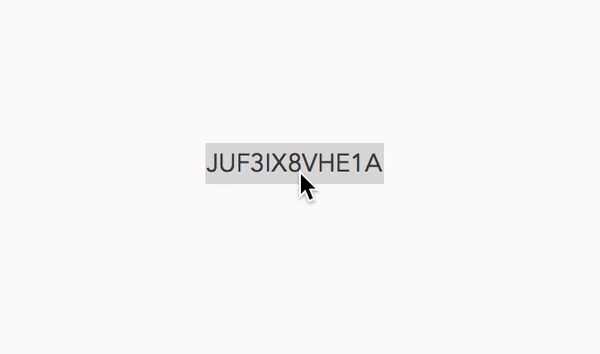

# Scannable-Promos
A script to create scannable iTunes promo codes to be redeemed in the App Store using the camera — based on: [Cracking the code behind Apple’s App Store promo card design](https://medium.com/@equinux/cracking-the-code-behind-apples-app-store-promo-card-design-d551dac40e45)

# Usage
### Automator Service

Clone the repository and move the “Make Scannable.workflow” file to the User/USER/Library/Services folder.  

Right click on a promo code and select Services>Make Scannable to quicklook a scannable promo code.

### PopClip Extension

With PopClip installed, complete the previous steps (Automator Service) and then double click the “PreviewPromo.popclipext” file to install the extension.

